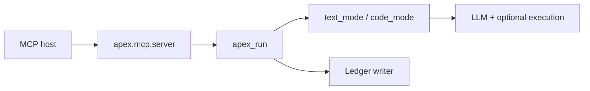

# Architecture

APEX splits **orchestration** (pipeline), **LLM work** (generation/review), **scoring**, and **MCP** so each layer is testable without loading the server.

## `src/apex/` layout

| Area | Module | Role |
|------|--------|------|
| MCP | `apex.mcp.server` | FastMCP: `run`, `health`, `describe_config`, `ledger_query`, `cancel_run`, optional `repo_*` ([mcp-tools.md](mcp-tools.md)) |
| Repo context | `apex.repo_context` | Allowlisted read/glob (env-gated); [repo-context.md](repo-context.md) |
| CLI | `apex.__main__` | `serve`, `init`/`setup`, `ledger summary` |
| Pipeline | `apex.pipeline.*` | `apex_run`, text/code modes, steps, traces, `finalize_run_result`, top-level error shaping |
| Observability | `apex.observability.progress_events` | Optional `APEX_PROGRESS_LOG` JSON lines (`apex.progress` logger); step hooks via `run_async_step` |
| Runtime limits | `apex.runtime.run_limits` | Optional `APEX_MAX_CONCURRENT_RUNS` / `APEX_RUN_MAX_WALL_MS` ([configuration.md](configuration.md)) |
| Ledger | `apex.ledger` | SQLite append after finalize (default `~/.apex/ledger.sqlite3`; `APEX_LEDGER_DISABLED=1` off) |
| Models | `apex.models` | Pydantic tool I/O |
| Config | `apex.config.*` | Constants, conventions merge, findings policy |
| Generation / Review / Scoring | `apex.generation`, `apex.review`, `apex.scoring` | Used by pipeline, not MCP directly |
| LLM | `apex.llm.*` | Client protocol, loader, Anthropic provider |
| Safety | `apex.safety.*` | Redaction, JSON extract, CoT heuristics |
| Execution | `apex.code_ground_truth.*` | Optional backend client + contract |

## Entrypoints

- **`apex.pipeline.run.apex_run`** — What `apex.run` calls.
- **`apex.pipeline.helpers`** — Shared helpers (`validate_code_bundles`, mode heuristic, etc.).

## Call direction

`apex.pipeline.*` does **not** import MCP; the adapter is one-way. Stage-by-stage map: [flow.md](flow.md) ( **`metadata.pipeline_steps`** = authoritative order / skips).

## Pipeline shape

1. **Catalog** (`steps_catalog`) — Step ids and intent (non-authoritative order).
2. **Implementation** (`text_mode` / `code_mode`) — **Order**; `run_async_step` / `skipped_step_record` from `step_support`.
3. **After each result** — `finalize_run_result` validates `pipeline_steps`, adds `metadata.telemetry` + `metadata.uncertainty`; ledger may append SQLite.

[pipeline-steps.md](pipeline-steps.md) · [robustness.md](robustness.md).

## Tests

Patch **where the name is used** (e.g. `apex.pipeline.text_mode.generate_text_variants`), not a re-export of the same symbol elsewhere. Eval cases: `tests/eval/`.
