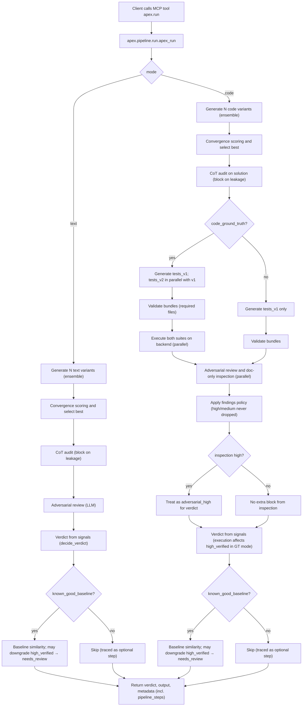

# APEX Flow

High-level behavior matches this chart. For **exact** stage names and order (including traced skips), use `metadata.pipeline_steps` and [pipeline-steps.md](pipeline-steps.md).

Chart matches current `text_mode` / `code_mode`. **`ensemble_runs`** is clamped to 2–3 (see `apex.config.constants`). With `code_ground_truth` off, execution stages are **skipped** but still appear as explicit rows in `metadata.pipeline_steps`.
