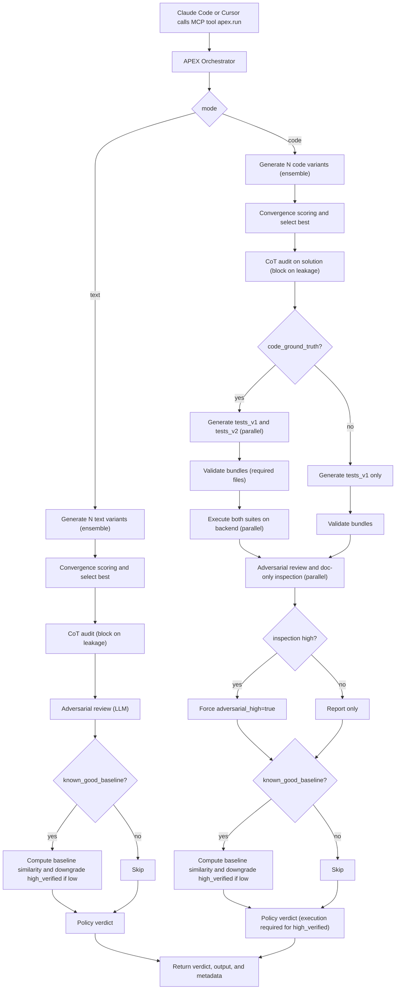

# APEX Flow

```mermaid
flowchart TD
  A["Claude Code or Cursor calls MCP tool apex.run"] --> B["APEX Orchestrator"]

  B --> C{mode}
  C -->|text| T1["Generate N text variants (ensemble)"]
  T1 --> T2["Convergence scoring and select best"]
  T2 --> T3["CoT audit (block on leakage)"]
  T3 --> T4["Adversarial review (LLM)"]
  T4 --> T5{known_good_baseline?}
  T5 -->|yes| T6["Compute baseline similarity and downgrade high_verified if low"]
  T5 -->|no| T7["Skip"]
  T6 --> T8["Policy verdict"]
  T7 --> T8
  T8 --> OUT["Return verdict, output, and metadata"]

  C -->|code| C1["Generate N code variants (ensemble)"]
  C1 --> C2["Convergence scoring and select best"]
  C2 --> C3["CoT audit on solution (block on leakage)"]
  C3 --> C4{code_ground_truth?}
  C4 -->|yes| C5["Generate tests_v1 and tests_v2 (parallel)"]
  C5 --> C6["Validate bundles (required files)"]
  C6 --> C7["Execute both suites on backend (parallel)"]
  C4 -->|no| C8["Generate tests_v1 only"]
  C8 --> C9["Validate bundles"]

  C7 --> C10["Adversarial review and doc-only inspection (parallel)"]
  C9 --> C10
  C10 --> C11{inspection high?}
  C11 -->|yes| C12["Force adversarial_high=true"]
  C11 -->|no| C13["Report only"]
  C12 --> C14{known_good_baseline?}
  C13 --> C14
  C14 -->|yes| C15["Compute baseline similarity and downgrade high_verified if low"]
  C14 -->|no| C16["Skip"]
  C15 --> C17["Policy verdict (execution required for high_verified)"]
  C16 --> C17
  C17 --> OUT
```

