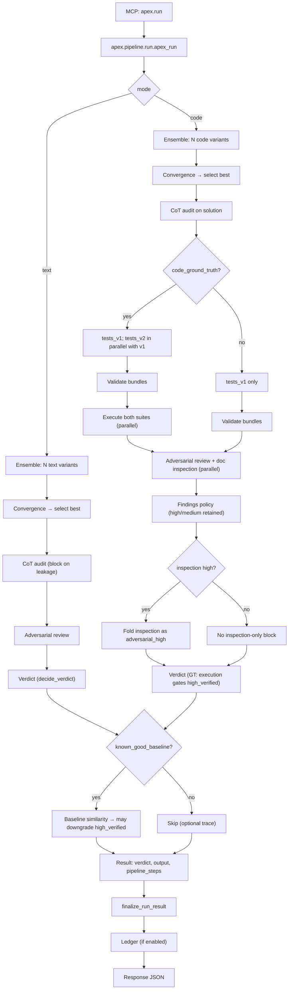

# Flow

**Map only** — canonical step IDs and order live in **`metadata.pipeline_steps`**. See [pipeline-steps.md](pipeline-steps.md).

**Constraints:** `ensemble_runs` clamped **2–3** (`apex.config.constants`). **Code, no ground truth:** no execution; steps still traced.

**Post-run:** `finalize_run_result` adds **`telemetry`** / **`uncertainty`**; SQLite ledger unless **`APEX_LEDGER_DISABLED=1`**. [pipeline-steps.md#observability-automatic](pipeline-steps.md#observability-automatic) · [configuration.md#run-ledger-sqlite](configuration.md#run-ledger-sqlite) · **`apex ledger summary`**.
