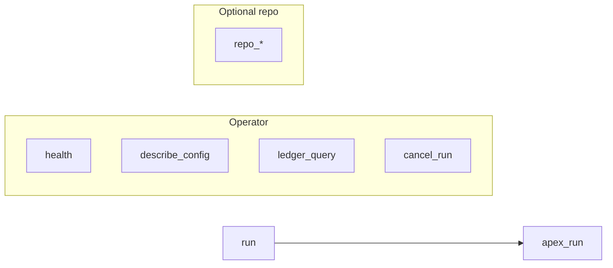

# MCP tools (operator surface)

Read-mostly tools plus **`run`**; versioned payloads include a **`schema`** field.

## Repo context (opt-in filesystem)

Bounded reads under **`APEX_REPO_CONTEXT_ROOT`**: `repo_context_status`, `repo_read_file`, `repo_glob`. See [repo-context.md](repo-context.md).

## `health`

- **Schema:** `apex.health/v1`
- **Secrets:** none
- **Fields (non-exhaustive):** `apex_version`, `python_version`, `llm_provider_default`, `ledger_*`, `execution_backend_configured`, `progress_log_enabled`, `repo_context_enabled`, `run_limits` (`{max_concurrent, wall_ms}`; `0` = off)

## `describe_config`

- **Schema:** `apex.config.describe/v1`
- **Secrets:** never returns API keys; file block uses `anthropic_api_key: "set" | "empty"` only
- **Use:** confirm effective env vs `~/.apex/config.json` before debugging a run

## `ledger_query`

- **Schema:** `apex.ledger.query/v1`
- **Args:** `limit` (default 20, clamped to `LEDGER_QUERY_MAX_LIMIT`), optional `run_id`
- **Behavior:** read-only SQLite; if ledger disabled, `ledger_enabled: false` and empty arrays
- **CLI parity:** `apex ledger query [--limit N] [--run-id UUID]`

## `cancel_run`

- **Schema:** `apex.cancel_run/v1`
- **Arg:** `correlation_id` (non-empty; charset `a-zA-Z0-9._-`)
- **Status:** `cancel_requested` | `not_found` | `invalid_id`
- **Semantics:** cooperative cancel at the next `await` inside `apex_run`. If the id is **reserved** (server accepted `correlation_id` but the task is not bound yet), cancel is queued and applied when the task starts — see [robustness.md](robustness.md#product-semantics-clients).

## `run`

Same verification contract as before, plus:

| Input | Notes |
|-------|--------|
| `correlation_id` | Optional; if set, must be valid (same charset). Registers the task for `cancel_run`. Duplicate active ids → `blocked` with `mcp_correlation_rejected` |
| `supplementary_context` | Optional; **code mode doc inspection only** — operator snippets / notes (bounded; not live RAG). Ignored for text mode |

**Input limits** apply inside **`apex_run`** (`apex.safety.run_input_limits`; `input_validation: true` on failure). Limits live in `apex.config.constants` (`MCP_MAX_*`).

On cooperative cancellation, returns `verdict: blocked`, `cancelled: true`, with normal finalize (`telemetry` / `uncertainty`) when applicable.

## Package imports

Submodules under `apex.mcp` (e.g. `input_guard`, `diagnostics`) do **not** require the `mcp` PyPI package at import time. Only `apex.mcp.server` imports FastMCP.
