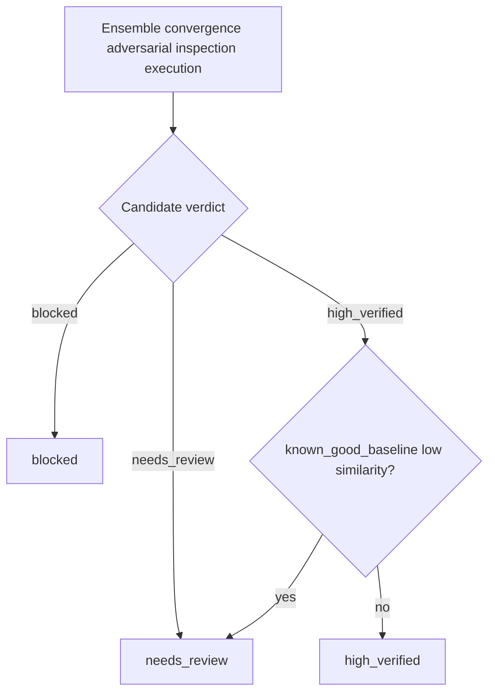

# Verification semantics

## What APEX is for

**In-editor / review-time:** quick signals—ensemble agreement, adversarial findings, optional small execution—so a human knows what to double-check.

**Not a substitute for CI:** full suites, builds, SAST, dependency scanning belong in your normal pipeline. APEX narrows attention; CI proves the repo.

## How a verdict is built

1. Ensemble + convergence (+ best candidate selection)  
2. Adversarial review; in **code** mode, **inspection** LLM pass in parallel  
3. Optional **execution** when `code_ground_truth=true` and a backend is configured  

Numeric gates: **`apex.config.constants`** (e.g. `HIGH_VERIFIED_CONVERGENCE_THRESHOLD`).

## Verdicts

**`high_verified`**

- **Text:** Convergence ≥ threshold, no adversarial **high** or **medium**, extraction OK (`execution_required=false`).
- **Code:** Same adversarial rules, but scoring always **`execution_required`**. Needs **both** suites **pass** on the backend. If `code_ground_truth=false`, execution is not run → **`high_verified` is not produced** (usually `needs_review` unless something else blocks).
- **Inspection:** Only **high** inspection findings join the same “block like adversarial high” path; medium/low inspection do not feed `DecisionSignals` today.

**`needs_review`**

- Signals inconclusive (e.g. execution unknown/off, or convergence/adversarial below `high_verified` bar).
- Or **`known_good_baseline`** forced a downgrade from `high_verified` (similarity below `BASELINE_SIMILARITY_DOWNGRADE_THRESHOLD`, default `0.8` in constants).

**`blocked`**

- Extraction/validation failure, CoT audit hit, adversarial or merged **high** inspection, definitive execution failure—or an **uncaught** error at the `apex_run` guard (missing LLM config, etc.). Guard failures use **`error_code`** + sanitized **`error`** (see [tool-interface.md](tool-interface.md)); pipeline-internal `blocked` may still use a plain **`error`** string.

## Metadata on every return

Even **`blocked`**: **`finalize_run_result`** adds **`telemetry`** (including **`trace_validation`**) and **`uncertainty`**. The **SQLite ledger** may also append unless disabled ([configuration.md#run-ledger-sqlite](configuration.md#run-ledger-sqlite)).

## `known_good_baseline`

Optional reference string. After the normal verdict logic, if the verdict would be **`high_verified`** but **string similarity** to the chosen output is below the threshold, APEX downgrades to **`needs_review`**. Heuristic only—not semantic equivalence.

## Findings policy (code)

May hide **low** noise; **`high` and `medium` are never stripped** ([configuration.md](configuration.md)).

- **Inspection high** can block like adversarial high.
- **Inspection medium/low** do not change verdict math; **adversarial medium** still blocks `high_verified`.
